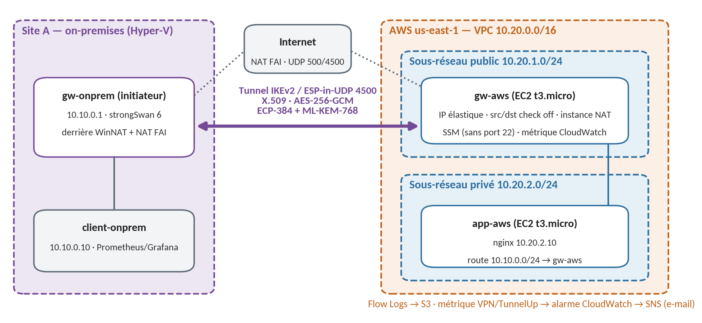

# VPN IPsec hybride post-quantique : site d'entreprise ↔ AWS

[](https://github.com/rayenmabrouk/hybrid-ipsec-vpn/actions/workflows/ci.yml)

Interconnexion sécurisée d'un site d'entreprise (simulé sous Hyper-V) avec un VPC AWS par un tunnel **IPsec IKEv2 à échange de clés hybride post-quantique** (ECDH P-384 + ML-KEM-768, RFC 9370), entièrement décrit en code : Terraform pour AWS, Ansible pour les passerelles, la PKI et la supervision.

Projet réalisé dans le prolongement de mon stage à Tunisie Telecom (Direction Régionale de Gafsa, juillet 2026), dont le sujet portait sur l'étude d'une solution VPN basée sur IPsec.

*English summary at the end.*



## Points clés

| Domaine | Choix |
|---|---|
| Protocole | IKEv2 (strongSwan 6.0, `swanctl`/VICI), ESP en mode tunnel, NAT-T (UDP 4500), MOBIKE, DPD |
| Échange de clés | Hybride **ECP-384 + ML-KEM-768** (FIPS 203) via `IKE_INTERMEDIATE` (RFC 9242) et `IKE_FOLLOWUP_KE` lors des rekeys, avec PFS hybride sur chaque CHILD_SA |
| Chiffrement | AES-256-GCM (IKE et ESP), PRF HMAC-SHA2-384 |
| Authentification | Certificats X.509 ECDSA P-384, PKI dédiée hors ligne, révocation par CRL |
| Référentiels | ANSSI DAT-NT-003 (IPsec) et ANSSI-FT-117 (transition post-quantique) |
| AWS | VPC 10.20.0.0/16, passerelle EC2 (EIP, instance NAT, SSM sans port 22), application en sous-réseau privé, VPC Flow Logs, alarme CloudWatch → SNS |
| Supervision | Métrique `VPN/TunnelUp` (CloudWatch) ; node_exporter, Prometheus et Grafana côté site |
| Automatisation | Reconstruction complète AWS + configuration en **5 min 26 s**, sans étape manuelle ; Ansible idempotent |

## Arborescence

```
terraform/          Infrastructure AWS (modules network, gateway, app, monitoring), état distant S3
ansible/            Inventaire hybride (SSH + aws_ec2/SSM) et rôles common, strongswan, pki, labsite, monitoring
scripts/            bootstrap-aws.sh, deploy.sh, destroy.sh, gen-csr.sh
configs/            Configurations swanctl/nftables de référence (phase manuelle)
tests/              Script de panne T5, configurations des tests de sécurité, résultats
docs/journal.md     Journal de réalisation : étapes, mesures, incidents et leurs causes
```

## Déploiement

### Prérequis

- **Site** : trois VM Ubuntu Server 26.04 sous Hyper-V (gw-onprem, client-onprem et, pour le mode hors ligne, gw-lab-b), accessibles en SSH depuis le poste d'administration.
- **Poste d'administration** (WSL Ubuntu) : Terraform ≥ 1.11, AWS CLI v2 et session-manager-plugin, ansible-core avec `boto3`, outil `pki` de strongSwan.
- **AWS** : un compte AWS (développé sur AWS Academy Learner Lab : rôle `LabRole`/`LabInstanceProfile`, aucun rôle IAM créé).

### 1. Autorité de certification (hors ligne, une seule fois)

```bash
mkdir -p ~/ipsec-pki && cd ~/ipsec-pki
(umask 077; pki --gen --type ecdsa --size 384 --outform pem > ca.key)
pki --self --ca --lifetime 3650 --in ca.key --digest sha384 --outform pem \
    --dn "C=TN, O=Hybrid IPsec VPN, CN=Hybrid IPsec VPN Root CA" > ca.crt
```

La clé de l'AC ne quitte jamais ce répertoire. Chaque passerelle génère sa propre clé ; seuls la CSR et le certificat signé circulent, et la signature est faite par le rôle `pki`.

### 2. Variables

```bash
cp terraform/terraform.tfvars.example terraform/terraform.tfvars   # IP publique du site, e-mail d'alerte
export GRAFANA_ADMIN_PASSWORD='…'                                  # 12 caractères minimum
```

### 3. Déploiement complet

```bash
scripts/deploy.sh -K
```

Le script enchaîne : création des buckets S3 (état, Flow Logs, transfert Ansible), `terraform apply`, attente de l'enregistrement SSM, puis `ansible-playbook site.yml`. Il se termine en vérifiant que le tunnel est établi en mode hybride et que l'application AWS répond depuis le LAN du site.

Après la création du topic SNS, il faut confirmer l'abonnement à partir du lien reçu par e-mail. C'est la seule étape manuelle, imposée par AWS.

- Tableau de bord Grafana : `ssh -f -N -L 3000:localhost:3000 client-onprem`, puis http://localhost:3000
- Mode de démonstration hors ligne, sans AWS : `ansible-playbook site.yml -K -e vpn_remote_site=lab`
- Destruction : `scripts/destroy.sh`

### Révocation d'un certificat

```bash
pki --signcrl --cacert ~/ipsec-pki/ca.crt --cakey ~/ipsec-pki/ca.key --reason key-compromise \
    --cert <certificat.crt> --lifetime 90 --digest sha384 --outform pem > ~/ipsec-pki/lab-ca.crl
cd ansible && ansible-playbook site.yml -K      # la CRL est distribuée à toutes les passerelles
```

## Tests et résultats

| Test | Objectif | Résultat |
|---|---|---|
| T1 | Confidentialité sur le WAN | Seul ESP-in-UDP circule sur le fil (Wireshark hors VM) ; ICMP et HTTP invisibles |
| T2 | Accès applicatif à travers le tunnel | Page d'app-aws servie à client-onprem (TTL 62, route via gw-onprem → gw-aws) |
| T3 | Débit avec et sans tunnel | 17,9 contre 19,0 Mbit/s, soit environ 6 % de surcoût (cohérent avec l'en-tête ESP-in-UDP) |
| T4 | Renouvellement des clés | Rekey CHILD_SA et IKE_SA sous charge : 0 % de perte, échange hybride à chaque rekey |
| T5 | Panne de la passerelle AWS | Reprise automatique 34 à 66 s après le retour ; alertes e-mail ALARM puis OK |
| T6 | Certificat d'une autre AC | Refusé (`AUTH_FAILED`) malgré un échange de clés hybride réussi |
| T7 | Certificat révoqué | Refusé : `certificate was revoked … key compromise` |
| T8 | Négociation affaiblie (sans ML-KEM) | Refusée dès IKE_SA_INIT : `NO_PROPOSAL_CHOSEN` |
| T9 | Surface d'exposition | TCP : 1000 ports filtrés ; seuls UDP 500 et 4500 acceptés (preuve par les VPC Flow Logs) |
| T10 | Reconstruction depuis zéro | 5 min 26 s, sans intervention |
| T11 | Échange hybride observable | `IKE_INTERMEDIATE [ KE ]` (ML-KEM-768, 1249 octets, fragmenté selon la RFC 7383) |

Reprise automatique observée dans trois scénarios : panne de la passerelle (T5), remappage NAT après redémarrage de l'hôte, et arrêt puis redémarrage des instances AWS. Le détail, avec les journaux et l'analyse des causes, se trouve dans [`docs/journal.md`](docs/journal.md).

## Limites connues

- L'**authentification reste classique** (ECDSA P-384) : seul l'échange de clés est post-quantique. Les signatures ML-DSA dans IKEv2 sont l'étape suivante.
- **Une seule passerelle** côté AWS, sans haute disponibilité. Le service AWS Site-to-Site VPN fournit deux tunnels, mais il ne propose pas d'échange de clés hybride ML-KEM.
- La CRL est publiée manuellement et doit être renouvelée avant son échéance ; en production, il faudrait l'automatiser ou passer à OCSP.
- La première CHILD_SA dérive ses clés de l'IKE_SA ; la PFS hybride s'applique à partir du premier rekey.

---

## English summary

Site-to-site **IKEv2/IPsec VPN with a hybrid post-quantum key exchange** (ECDH P-384 + ML-KEM-768, RFC 9370) between an on-premises site (Hyper-V lab behind double NAT) and an AWS VPC, built entirely as code: Terraform for AWS (VPC, EC2 gateway with SSM-only administration, private application subnet, Flow Logs, CloudWatch alarm with SNS) and Ansible for the gateways (strongSwan 6, offline ECDSA P-384 PKI with CRL distribution, nftables, Prometheus/Grafana monitoring).

A full rebuild takes about 5.5 minutes with no manual step. Eleven tests cover WAN confidentiality, throughput (about 6 % IPsec overhead), rekeying with no packet loss, gateway failure and automatic recovery, rogue-CA and revoked-certificate rejection, downgrade rejection, attack surface verified with VPC Flow Logs, and observation of the hybrid exchange. Known limits: authentication is still classical (ECDSA), and there is a single, non-HA AWS gateway.

Project documentation, including the build journal, is in French.
